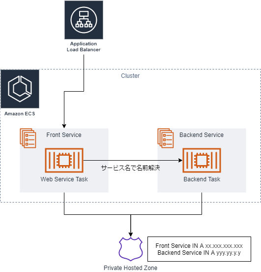

# ECS-fargate サービス間通信デモ

プライベートサブネット内のフロントエンドをALB経由で公開し、自動起動されたバックエンドタスクからのレスポンスをフロントのWEBサーバーが表示する構成。

各タスクは自動的にSSMエージェントに登録されれ、セッションマネージャーでログイン可能。



# 構成

```
/backend-mock/ ...node.jsのAPIサーバー("This section backend API response"を返す)
/ssm-to-fargate/ ...node.jsのWEBサーバー
docker-compose.yml ...ローカルデバッグ用
```

# ENV

```
export SSM_AGENT_CODE={SSMのハイブリッドアクティベーションコード}
export SSM_AGENT_ID={SSMのハイブリッドアクティベーションID}
export AWS_DEFAULT_REGION={region}
export BACKEND_HOST_URL=http://{バックエンドサービスのプライベートホスト名}:8000/
```

# local

`docker-compose up --build`

`localhost` にアクセスすると、バックエンドからのレスポンスが表示される

# 構築

1. 以下のサービスを作成する(ターゲットグループはリスナー未設定)
  - VPC
  - ALB
    - Target Group(IP)
  - Private Subnet/Public Subnet
  - ECS cluster
  - ECR*2
2. ECRの2リポジトリにそれぞれバックエンド・フロントエンドのコンテナをプッシュする
3. タスク定義を作成し、2で作成したコンテナを登録する。フロントエンドコンテナは80ポートで公開。
4. ECSでフロントエンドのサービスを作成する。ロードバランサーを作成し、「サービスの発見」を利用してプライベートホストゾーンをVPCに作成する。
  - サービスのVIPが自動的にALBのターゲットグループに登録される  
4. バックエンドのサービスを作成する。こちらもサービスの発見を有効にする。
5. フロントエンドのタスク定義環境変数(`BACKEND_HOST_URL`)にバックエンドサービスのURLを登録する
6. サービスをすべて再デプロイする
7. ALBのドメインにアクセスして、レスポンスを確認
